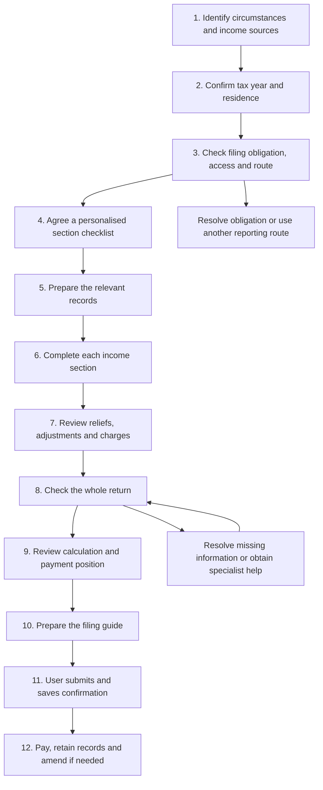

# Interactive Self Assessment walkthrough

Design date: 18 September 2026. Initial reference year: **2025–26, from 6 April 2025 to 5 April 2026**.

This is a proposed user journey for an individual completing their own UK Self Assessment return. The tool explains what belongs in each field and generates clearly labelled examples. The user supplies their own figures, chooses claims, checks the result and submits through an appropriate filing service. This document designs the experience; it does not implement the tool or establish that every tax rule has been verified.

The supporting publications and remaining reference-data work are in [Data sources](data-sources.md), with individual downloads in the [source index](self-assessment/INDEX.md). User documents are inputs to the future journey, not files required in this repository.

## Overall journey

At any step, the user can save, return to an earlier answer, ask for an explanation or continue with an independent section. Unresolved questions remain visible and prevent the affected section from being marked ready.

## Rules for the conversation

- Ask one main question at a time. Use short follow-ups only where the answer changes the next step.
- Offer **“I'm not sure”** alongside substantive choices. Never interpret uncertainty as “No”, zero or a blank entry.
- Explain why a question matters before asking for detailed figures.
- Keep fictional examples separate from the user's draft. Never copy example amounts into their return automatically.
- End each stage with a plain-language summary and **“Confirm and continue”**, **“Change an answer”** and **“Explain this”** actions.
- A stage is clear when the user understands the output and its unresolved items, not merely when they have visited every screen.
- Show progress through the user's relevant sections, rather than through every possible tax-return page.
- When an earlier answer changes, reopen the affected sections and calculations for review. Preserve earlier entries visibly; do not silently discard or retain an inapplicable claim.
- Distinguish **needs information**, **needs explanation**, **needs specialist review**, **ready for user review**, and **confirmed**. A confirmed section is still subject to the whole-return check.

## 1. Identify the user's circumstances and income sources

**Ask:** “During the tax year you want to report, which of these applied to you? Select all that apply.” Display the provisional year prominently; allow it to be changed immediately.

| Choice | Plain-language follow-up | Route to investigate |
|---|---|---|
| Employee | How many jobs did you have, including jobs you left during the year? | Employment, repeated for each relevant employment |
| Sole trader or freelancer | Did you work for yourself personally, and how many separate businesses did you run? | Self-employment, repeated by business |
| Company director or owner | Were you paid a salary, dividends, benefits or other amounts by your company? | Personal employment, dividends and any other relevant treatment |
| Partner in a business partnership | Do you have the partnership's statement of your share of income? | Personal partnership income |
| Landlord | Was the property in the UK or abroad, and did you own it alone or jointly? | Property and/or foreign-income questions |
| Pension recipient | Did you receive a State Pension, workplace/private pension or overseas pension? | Pension and any foreign-income questions |
| Savings or investments | Did you receive interest, dividends or other investment income? | Savings, dividends and other relevant income |
| Sold, gave away or exchanged assets | What kind of assets: property, shares, cryptocurrency or something else? | Check capital gains reporting; do not assume every disposal is taxable |
| Income from abroad | What income, from which countries, and was foreign tax paid? | Foreign income and residence review |
| Income from a trust or estate | Are you reporting income you received personally, or acting for the trust/estate? | Individual beneficiary income or a separate return journey |
| Other income or circumstances | Describe it briefly, or choose “I'm not sure”. | Clarification and specialist routing where needed |
| None of these | Has HM Revenue & Customs (HMRC) asked you to file, or are you seeking a tax refund or relief? | Continue to the filing-obligation check |

Explain that these choices can overlap. Owning a limited company does not make its sales the individual's sole-trader income. A partner's personal return and the partnership's own return are separate tasks.

For uncertain employment status, ask about the actual working arrangement and identify the evidence needed; do not classify someone solely because they call themselves a contractor.

**Show:** “You had two jobs and one freelance business. We will check employment and self-employment, then check whether other sections apply.”

**Clear when:** the user confirms the initial profile, with any uncertain classifications recorded for resolution.

## 2. Confirm the tax year and residence

**Ask:** Which tax year is this for? Is this a first submission or a correction? Are you completing your own individual return?

Then ask whether the user lived in the UK throughout that year, moved into or out of the UK, or had homes/time abroad. Ask where they lived within the UK and about moves relevant to Scottish or Welsh tax treatment. An address or nationality alone must not settle tax residence.

**Show:** The exact start and end dates, chosen return year, original/correction status, and any residence questions requiring further investigation.

**Branch:** Complex residence, a year with both UK-resident and non-resident periods, or foreign-income relief claims need the appropriate year-specific questions and verified guidance. A company return, partnership entity return, or trustee/executor return leaves this individual journey. Another tax year requires its own reviewed source pack.

**Clear when:** the year and return type are confirmed; residence is resolved or the affected work is explicitly awaiting specialist review. Unrelated preparation may continue.

## 3. Check whether to file, how to file and when

**Ask:** Has HMRC issued a notice to file? Have you filed before? Are you registered and able to access your intended filing service? What is the reason for filing?

Use the [official filing checker](https://www.gov.uk/check-if-you-need-tax-return) and year-specific rules. Being an employee, director or sole trader is an initial routing answer, not a complete filing-obligation decision. If HMRC has asked for a return, do not tell the user to ignore it based on a simplified income check; direct any request to withdraw the requirement to HMRC. See the [official overview](https://www.gov.uk/self-assessment-tax-returns).

**Show:** One of “Return required”, “Return may be appropriate for a claim”, “Another reporting route may apply”, or “Need to resolve this first”, with the reason and next action. Give registration/access instructions where needed; the walkthrough does not need the user's login credentials.

Choose a filing route that supports all relevant sections: HMRC's online service, suitable commercial software, or paper. Verify the route against the [official submission guidance](https://www.gov.uk/self-assessment-tax-returns/sending-return); do not assume every individual can use the same online service.

For a standard 2025–26 individual return, show these dates, subject to any different deadline notified by HMRC:

| Action | Standard date |
|---|---|
| Notify HMRC where registration/notification is required | 5 October 2026 |
| HMRC receives a paper return | 31 October 2026 |
| Submit online | 31 January 2027 |
| Pay the balancing amount due | 31 January 2027 |

Check special deadlines and payment arrangements separately using [HMRC's deadline guidance](https://www.gov.uk/self-assessment-tax-returns/deadlines).

Also screen for **Making Tax Digital for Income Tax**, the digital recordkeeping and reporting process for qualifying individuals. Determine the applicable start year separately from the return being prepared. A 2025–26 return and obligations starting in 2026–27 can coexist. Use the [official eligibility guidance](https://www.gov.uk/guidance/find-out-if-and-when-you-need-to-use-making-tax-digital-for-income-tax).

**Clear when:** the user understands their filing reason, intended route, deadlines and outstanding registration/access tasks. Access tasks may run alongside preparation but must be resolved before submission.

## 4. Agree a personalised section checklist

**Ask:** A short completeness check for income not selected initially, plus possible pension contributions, charitable giving, student loans, Child Benefit, earlier losses and previous tax payments. Detailed treatment follows later.

**Show:** Required sections, why each appears, and any conditional sections awaiting an answer. Let users add a forgotten source at any time.

Example checklist: “Personal details → Job A → Job B → Freelance business → Bank interest → Pension contributions → Final checks.”

The main individual form is SA100; additional forms are called supplementary pages. The [official annual forms and notes](https://www.gov.uk/guidance/how-to-complete-your-self-assessment-tax-return-for-last-tax-year) provide the reference structure. Use their year-specific criteria to select short/full business pages and specialist pages. Do not infer eligibility for a short form from the user's description of their business as “small”.

**Clear when:** the user confirms the checklist covers their circumstances and understands any unresolved section choices.

## 5. Prepare the relevant records

**Ask:** “Do you have the information for this section now?” Offer “Ready”, “Some missing”, and “Explain what I need”. Request records only for selected sections.

| Section | Examples of records to explain |
|---|---|
| Employment | P60 annual pay-and-tax certificate, P45 leaving certificate where relevant, benefit details and expense records |
| Self-employment | Sales and expense records, accounting dates, asset purchases, earlier losses and prior-return adjustments |
| Partnership | Statement of the individual's share from the partnership |
| Property | Rental income, expenses, ownership shares and finance-cost records |
| Savings/dividends | Annual interest summaries and dividend statements |
| Pensions/charity | Contribution statements, pension income and donation records |
| Foreign income/gains | Income and tax statements, currencies, transaction dates and relevant calculations |
| Asset disposals | Acquisition and disposal records, costs, earlier losses, and any separate tax reports/payments |

**Show:** A checklist by section, explaining which figure each record supports. Mark records already supplied and missing facts precisely. Do not require uploading documents if the user can enter verified figures themselves.

**Clear when:** the user knows what to use and what remains missing. They may complete other sections while gathering records.

## 6. Complete income sections using the same field-by-field loop

Repeat for each applicable section and each separate employment/business where required. Use one consistent interaction:

1. **Explain the field:** official label, meaning, relevant period, inclusions/exclusions, and whether the amount is before or after deductions.
2. **Point to the evidence:** identify the figure on the relevant record, including common mistakes such as confusing take-home pay with taxable pay.
3. **Offer a fictional example:** show the assumed facts, sample entry and why it belongs here. Label every example clearly.
4. **Let the user enter their figure:** allow “I don't know yet”. Where calculation is needed, collect the components and show the working.
5. **Check the entry:** apply the field's rules for dates, currency, rounding, signs, blank versus zero and consistency with related fields. Do not invent a universal rounding rule.
6. **Confirm the result:** repeat the proposed entry, its source and any assumptions. Ask whether the user understands and agrees before marking it confirmed.

Every field explanation should have a “Why?” link to the relevant annual notes or helpsheet. A suggested amount based on the user's facts should identify those facts; a fictional amount must remain an example.

### Employment example

**Tool:** “This field asks for pay from this employment before tax was deducted. Use the figure identified in the annual notes for this employment, rather than the total deposited in your bank account.”

**Fictional example:** “If the relevant taxable-pay figure is £32,400, the sample pay entry is £32,400. Tax deducted is recorded separately.”

**User action:** Enter their own amount and confirm its source. When there were multiple jobs, check that a carried-forward previous-employment amount has not been counted again.

### Questions specific to each branch

| Branch | Establish before confirming the section |
|---|---|
| Employment | Each employment, pay, tax deducted, benefits and any qualifying expense claims |
| Self-employment | Each trade, start/cessation dates, accounting period and method, turnover, expense/allowance choices, asset treatment, losses and relevant previous-year adjustments |
| Partnership | Correct partnership and period, allocated income, tax and adjustments from its statement |
| Property | Location, ownership share, income type, expenses, finance costs, applicable allowance choices and losses |
| Savings/dividends | Income category, taxable/exempt treatment, gross amount where required and any tax withheld |
| Pensions | Pension type, taxable amount, tax deducted and special lump-sum treatment where applicable |
| Foreign income | Country, income category, currency conversion, foreign tax and any relief claim requiring review |
| Capital gains | Disposal and acquisition facts, costs, losses, reliefs, and reconciliation with separate reports/payments |
| Trust/estate income | Nature of the distribution and the supporting statement's income/tax categories |

These are discovery prompts, not a substitute for the exact annual field rules. Cryptocurrency, for example, may require income questions as well as disposal questions; the asset label alone does not settle treatment.

**Clear when:** every applicable field has an understood and confirmed treatment, or a named unresolved issue. A section with unresolved issues cannot become ready for filing.

## 7. Review reliefs, adjustments and additional charges

**Ask:** Follow up on the checklist from step 4: pension contributions and how relief was already given, Gift Aid donations, relevant losses, student/postgraduate loans, Child Benefit circumstances, and other applicable claims or charges.

**Show:** Each applicable item, why it matters, the evidence needed and any choice the user must make. Explain consequences before asking them to choose between alternative claims. Do not automatically select whichever produces the lowest immediate estimate without considering eligibility and effects on other years.

Check for deductions already reflected elsewhere, such as pension contributions treated through payroll, to avoid suggesting the same relief twice. Unusual claims use their specific notes and review path.

**Clear when:** applicable adjustments are confirmed and uncertain claims remain explicitly unresolved rather than being silently omitted.

## 8. Review the whole return

**Show:** A readable summary organised by source, with the user's figures, where they came from, chosen claims, and any explanation to accompany the return.

Check completeness against the original profile; duplicate income or deductions; arithmetic and totals; the tax-year allocation; unresolved residence questions; and reconciliation with earlier reports and payments.

Present each issue as a concrete action: “You selected two jobs, but only one employment section is complete. Add the second job or change your earlier answer.” Return the user directly to that question.

Missing figures must not be replaced with invented examples. Where official rules permit provisional figures, explain the basis, required disclosure and later correction, and obtain the user's confirmation. See [HMRC's guidance on unknown profits](https://www.gov.uk/self-assessment-tax-returns/sending-return).

**Clear when:** no unexplained gaps or conflicting answers remain. Any permitted provisional treatment is documented and understood. Specialist issues must be resolved before labelling the whole return ready.

## 9. Review the calculation and payment position

**Show:** If a verified calculation is available, explain the movement from income to taxable amounts, tax and other applicable charges, then deductions/credits. Otherwise, use the calculation supplied by the chosen filing service and help the user understand it; do not present an unverified tool estimate as a final bill.

Separate the return-year liability from the remaining balance after payments and from **payments on account**, advance instalments towards a later tax bill. Reconcile with the user's HMRC account rather than deriving the amount still payable from income alone. See [the official payments-on-account explanation](https://www.gov.uk/understand-self-assessment-bill/payments-on-account).

**Ask:** “Do these income totals match your records, and do you understand the amount due and its dates?” Investigate a material mismatch between the draft and filing-service calculation before proceeding.

**Clear when:** the user understands the calculation, its source, any limitations and the payment position. A provisional estimate alone does not confirm what HMRC's account says is payable.

## 10. Prepare the guide the user will follow while filing

**Show:** A guide for the selected year and filing route. For each entry include:

- Section and exact field label; paper form/box reference where applicable.
- The user's confirmed value or answer, separated from illustrative examples.
- A short reason and source-record reference.
- Any required explanation, disclosure or supporting calculation.

Paper form boxes must not be presented as verified online screen labels. Until online mappings have been checked, identify them as form references and direct the user to match the official field wording. An unfamiliar screen returns to clarification, not a guessed entry.

**Ask:** “Have you checked that the values entered in your filing service match this guide?” Repeat checks if the service asks new questions or changes a calculation.

**Clear when:** all required entries and disclosures have been transferred and reconciled. “Guide prepared” does not mean “Return submitted”.

## 11. User reviews the declaration and submits

**Show:** Final checklist: correct person/year, complete income, confirmed claims, resolved issues, required disclosures, and agreement between the guide and actual return.

The user reads the filing service's declaration and submits there, or signs and sends the paper return. The tool does not accept the declaration or submit on their behalf.

**Ask afterwards:** “Did you receive a submission confirmation?” Let the user record its date and reference, and keep a copy of the submitted return and calculation. For paper, distinguish evidence of posting from confirmation of receipt.

**Clear when:** submission status is accurately recorded. If submission fails or no confirmation is available, retain “Prepared — submission not confirmed” and give the relevant next action. Never infer success from reaching the last walkthrough screen.

## 12. Payment, records and later corrections

**Show:** Remaining payment tasks and dates, any expected refund, records to retain and the retention period applicable to the user's circumstances. Filing completion and payment completion have separate statuses.

If figures were provisional, create a clear follow-up to replace them. For later corrections, preserve the submitted version, identify the changed facts, rerun affected checks and guide the user through the appropriate amendment route. Use [HMRC's correction guidance](https://www.gov.uk/self-assessment-tax-returns/corrections).

**Clear when:** the user has their submission record and understands all outstanding payment, recordkeeping and correction tasks.

## Example path: employee with a freelance business

1. Selects employee and sole trader; the tool keeps both branches.
2. Confirms 2025–26 and answers the residence questions.
3. Checks the filing requirement and registration/access position; chooses a supported route.
4. Adds bank interest during the completeness check and confirms the three income sections.
5. Has employment and interest records ready; marks business expenses as missing.
6. Completes employment and interest using the field loop; business remains unfinished.
7. Returns with business records, completes that section and reviews applicable reliefs/charges.
8. Resolves whole-return checks, compares the calculation and confirms the filing guide.
9. Enters and submits the return personally, saves confirmation and follows the payment checklist.

No filing requirement or tax amount is inferred merely from the labels in this example.

## Reference work required before implementation

This flow can guide product design now. Before presenting field-specific suggestions as dependable, complete the [datasets still to assemble](data-sources.md#information-still-to-assemble-for-the-tool): reviewed section-selection rules, annual field definitions, verified filing-route mappings, calculation/validation rules and checked fictional examples. Each supported branch needs those references and an explicit boundary for cases it cannot resolve.

The workflow sequence and checkpoints above are product-design proposals. Tax treatment, deadlines and route availability must remain tied to the applicable official guidance, tax year and review date.
